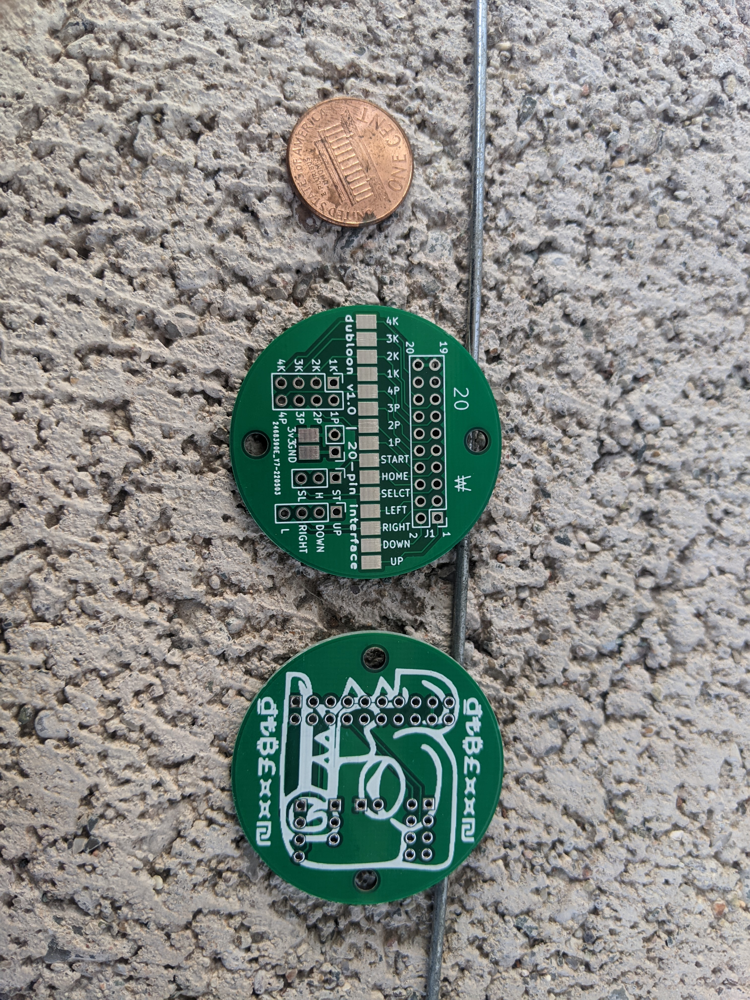
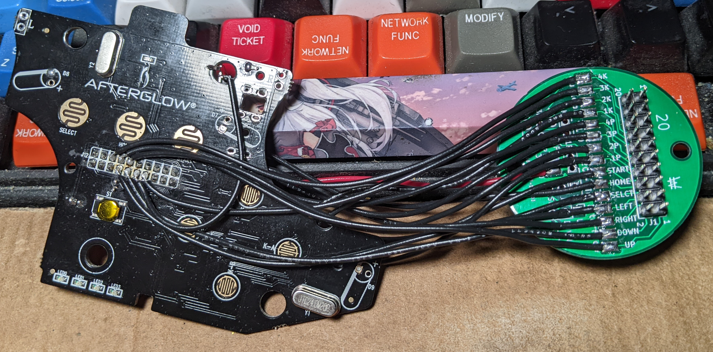

# DUBloon-20-pinout
This pcb organizes controller pad signals to easily interface with the Brook 20-pin wire harness allowing for fast swaps between consoles / controllers.

BOM:
2.54" 2x10 straight pin header male

